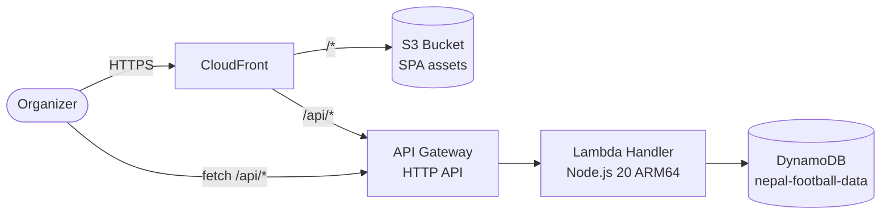
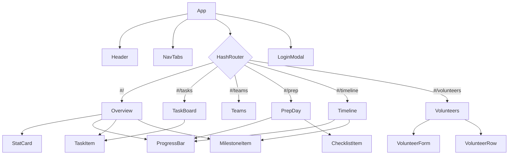
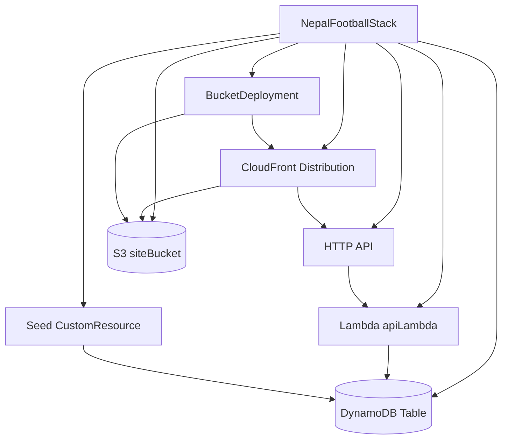

# Design Document

## Overview

The Nepali Europapokal 2026 Manager is a small, organizer-facing single-page application that replaces an existing AngularJS static page with a TypeScript + React SPA backed by AWS serverless infrastructure. The frontend is a Vite-built static bundle hosted on S3 and served via CloudFront. The backend is a single AWS Lambda function fronted by an API Gateway HTTP API, persisting data in a single DynamoDB table. Infrastructure is defined in AWS CDK (TypeScript) for one-command deploys.

The goals are:
- Keep the visual design (colors, typography, layout) identical to the original template.
- Add persistent state for tasks, teams, prep checklist items, and timeline milestones.
- Stay simple and cheap to run — pay-per-request DynamoDB, single Lambda, single CDK stack.
- Be easy for one developer to deploy in minutes via `npm run deploy`.

The v2 release adds admin authentication (session-token login) and a Volunteer management feature: an admin-only entry form and a public Volunteer tab backed by new DynamoDB items and API endpoints.

The v2 release adds admin authentication (session-token login) and a Volunteer management feature: an admin-only entry form and a public Volunteer tab backed by new DynamoDB items and API endpoints.

## Architecture



> **Admin login flow:** the SPA POSTs credentials to `POST /auth/login`; the Lambda validates against a hard-coded admin credential stored as a Lambda environment variable (hashed with bcrypt) and returns a short-lived JWT signed with a secret also stored in env vars. The JWT is stored in `sessionStorage` and sent as `Authorization: Bearer <token>` on all admin-only API calls.

Layers:
- **CloudFront** — global CDN, terminates TLS, serves SPA assets from S3 and proxies `/api/*` to API Gateway. SPA routing handled via 404 → `/index.html`.
- **S3** — private bucket holding the built Vite assets. Accessed only via CloudFront Origin Access Control (OAC).
- **API Gateway HTTP API** — lightweight, cheaper than REST API; routes mapped to a single Lambda integration.
- **Lambda** — single Node.js 20 function on ARM64. Internal switch on `event.routeKey` dispatches to handler functions.
- **DynamoDB** — single table, on-demand billing. Holds all entity types under different `PK` values.

**Admin login flow:** the SPA POSTs credentials to `POST /auth/login`; the Lambda validates against a hard-coded admin credential stored as a Lambda environment variable (hashed with bcrypt) and returns a short-lived JWT signed with a secret also stored in env vars. The JWT is stored in `sessionStorage` and sent as `Authorization: Bearer <token>` on all admin-only API calls.

## Project Structure

Monorepo using npm workspaces. The existing `site/` template is preserved for reference.

```
nepal-football/
├── package.json              # root, npm workspaces
├── tsconfig.base.json
├── frontend/                 # React + Vite SPA
│   ├── package.json
│   ├── vite.config.ts
│   ├── index.html
│   └── src/
│       ├── main.tsx
│       ├── App.tsx
│       ├── api/
│       │   ├── client.ts
│       │   └── hooks.ts
│       ├── components/
│       │   ├── Header.tsx
│       │   ├── NavTabs.tsx
│       │   ├── ProgressBar.tsx
│       │   ├── StatCard.tsx
│       │   ├── TaskItem.tsx
│       │   ├── ChecklistItem.tsx
│       │   ├── MilestoneItem.tsx
│       │   ├── LoginModal.tsx
│       │   ├── VolunteerForm.tsx
│       │   └── VolunteerRow.tsx
│       ├── views/
│       │   ├── Overview.tsx
│       │   ├── TaskBoard.tsx
│       │   ├── Teams.tsx
│       │   ├── PrepDay.tsx
│       │   ├── Timeline.tsx
│       │   └── Volunteers.tsx
│       └── styles/
│           └── global.css
├── backend/                  # Lambda handlers
│   ├── package.json
│   ├── tsconfig.json
│   └── src/
│       ├── handler.ts        # entry point + router
│       ├── routes/
│       │   ├── tasks.ts
│       │   ├── teams.ts
│       │   ├── prep.ts
│       │   ├── milestones.ts
│       │   ├── bootstrap.ts
│       │   ├── volunteers.ts
│       │   └── auth.ts
│       ├── db/
│       │   └── ddb.ts        # DynamoDB client + helpers
│       └── lib/
│           ├── response.ts   # JSON responses, CORS
│           └── errors.ts
├── shared/                   # shared types
│   ├── package.json
│   └── types.ts              # Task, Team, PrepItem, Milestone, Bootstrap, ApiError, Volunteer, VolunteerDay, LoginRequest, AuthResponse
├── infra/                    # AWS CDK stack
│   ├── package.json
│   ├── cdk.json
│   ├── bin/
│   │   └── app.ts
│   └── lib/
│       ├── nepal-football-stack.ts
│       └── seed-data.ts      # initial data for custom resource
├── site/                     # original AngularJS template (reference only)
│   └── NepaliEuropapokal2026 Manager.html
└── .kiro/                    # specs
    └── specs/nepal-football-spa/
```

## Components and Interfaces

The components and interfaces are organized into Frontend (React component tree, hooks) and Backend (Lambda routes, shared TypeScript types). See the two sections below.

## Frontend Design

### Tech Stack
- **React 18** with **TypeScript**
- **Vite** for dev server and build (`vite build` outputs static assets to `dist/`)
- **@tanstack/react-query** for all server state (caching, mutations, optimistic updates)
- **react-router-dom** with `HashRouter` — works on S3/CloudFront without server-side rewrites; URL hash drives the active tab as required by Requirement 1.5
- **Plain CSS** with CSS custom properties; one global stylesheet derived from the template

No global client-state library — React Query covers all server-derived state, and component state covers the rest.

### Component Tree



### Component Specifications

**App** (`src/App.tsx`)
- Props: none
- Wraps the tree in `QueryClientProvider` and `HashRouter`
- Renders `Header`, `NavTabs`, and the routed view
- Imports `styles/global.css`

**Header**
- Props: none
- Static markup — Nepal flag, eyebrow text, title, venue/date meta
- No data fetched

**NavTabs**
- Props: none
- Reads current location from `useLocation()`
- Renders six `<NavLink>`s for `/`, `/tasks`, `/teams`, `/prep`, `/timeline`, `/volunteers`
- Applies `active` class with gold underline on the matching route, semi-transparent white otherwise

**Overview** (Dashboard)
- Props: none
- Data fetched via `useBootstrap()` (returns tasks, teams, prepItems, milestones in a single request)
- Children: `StatCard` ×4, `ProgressBar` ×2, list of high-priority `TaskItem`s (read-only display), first 5 `MilestoneItem`s, event-info banner
- Computes derived stats (counts, percentages) in-component using `useMemo`

**TaskBoard**
- Props: none
- Data: `useTasks()`
- Mutation: `useToggleTask()` with optimistic update
- Children: `TaskItem` for each task, sorted by priority (high → medium → low), then time
- Wraps in a single `card` container matching template

**Teams**
- Props: none
- Data: `useTeams()`
- Renders a 2-column grid of team cards. No mutations.
- Each team card: icon, name, volunteer count, list of assigned tasks (max 5), 5px left-border in `team.color`

**PrepDay**
- Props: none
- Data: `usePrepItems()`
- Mutation: `useTogglePrepItem()`
- Children: `prep-banner` (static), `ProgressBar`, list of `ChecklistItem`s

**Timeline**
- Props: none
- Data: `useMilestones()`
- Mutation: `useToggleMilestone()`
- Children: `ProgressBar`, vertical timeline rendering one `MilestoneItem` per entry

**Shared components**

- `ProgressBar` — props: `label: string`, `done: number`, `total: number`, `gradient?: string`. Renders header (label + percentage), bar, and sub-line (done/remaining).
- `StatCard` — props: `icon: string`, `value: string | number`, `label: string`, `accent?: 'navy'|'red'|'gold'|'green'`.
- `TaskItem` — props: `task: Task`, `onToggle?: (task: Task) => void`, `compact?: boolean`. Renders checkbox, name, team, time, priority badge. If `onToggle` is omitted, item is read-only (used on Overview's high-priority list).
- `ChecklistItem` — props: `item: PrepItem`, `onToggle: (item: PrepItem) => void`. Renders checkbox + label.
- `MilestoneItem` — props: `milestone: Milestone`, `onToggle?: (m: Milestone) => void`, `withDot?: boolean`. Renders timeline dot (if `withDot`), icon, task, date pill.

**LoginModal**
- Props: `{ isOpen: boolean, onClose: () => void, onSuccess: () => void }`
- Renders a modal overlay with username input, password input, submit button, and inline error display
- On submit calls `POST /auth/login`; on 200 stores the JWT in `sessionStorage` under key `admin_token`, calls `onSuccess`, closes modal
- On 401 displays "Invalid username or password" inline; keeps modal open
- Accessible: inputs have associated `<label>` elements; modal traps focus; Escape key closes modal

**VolunteerForm**
- Props: `{ volunteer?: Volunteer, onSave: (v: Volunteer) => void, onCancel: () => void }`
- Renders: name text input (required, maxLength 100), three checkboxes (Friday, Saturday, Sunday), multi-select task list populated from `useTasks()` query cache
- Validation on submit: name empty → show "Name is required"; no day checked → show "Select at least one day"
- Pre-populates fields when `volunteer` prop is provided (edit mode); stale task refs omitted from selector
- Calls `POST /volunteers` (create) or `PUT /volunteers/{id}` (edit); on success calls `onSave`; on API error shows error message and keeps form open

**VolunteerRow**
- Props: `{ volunteer: Volunteer, isAdmin: boolean, onEdit: (v: Volunteer) => void, onDelete: (id: string) => void }`
- Renders a `<tr>` with: name cell, three checkbox cells (read-only checked/unchecked), tasks cell (comma-separated task names)
- When `isAdmin` is true, renders edit icon button and delete icon button in an actions cell
- Delete button triggers a `window.confirm` dialog; on confirm calls `onDelete`

**Volunteers** (view)
- Props: none
- Data: `useVolunteers()` query (`GET /volunteers`)
- Auth state: reads `admin_token` from `sessionStorage`; `isAdmin = !!token`
- Renders: page header, "Add Volunteer" button (visible only when `isAdmin`), table with columns Volunteer Name / Friday / Saturday / Sunday / Tasks / (Actions if admin)
- When no volunteers: renders "No volunteers registered yet" message
- When `isAdmin` and "Add Volunteer" clicked: opens `VolunteerForm` in create mode
- On edit icon click: opens `VolunteerForm` in edit mode pre-populated
- On delete confirmed: calls `DELETE /volunteers/{id}` mutation; on success removes row; on error shows toast "Couldn't delete volunteer, please retry"
- On load error: shows "Volunteer information is unavailable"

### State Management

All server state flows through React Query:
- `queryKey: ['tasks']`, `['teams']`, `['prep']`, `['milestones']`, `['bootstrap']`, `['volunteers']`
- `staleTime: 30_000` to avoid chatty refetches
- Mutations (`useToggleTask`, `useTogglePrepItem`, `useToggleMilestone`) use **optimistic updates**:
  1. `onMutate` cancels in-flight queries, snapshots the previous list, and writes the new state into the cache.
  2. `onError` restores the snapshot and surfaces a toast.
  3. `onSettled` invalidates the query.

This pattern satisfies Requirements 3.6, 5.6, and 6.6 (revert on failure with error message).

Volunteer mutation hooks: `useCreateVolunteer`, `useUpdateVolunteer`, `useDeleteVolunteer`. Delete uses a standard (non-optimistic) mutation since the confirmation dialog already provides a deliberate UX gate.

Local UI state (current tab, hover, etc.) is component-local.

### Styling Approach

- One global stylesheet `src/styles/global.css` ports the template CSS verbatim (CSS custom properties, classes like `.card`, `.task-item`, `.tl-card`).
- Components use those class names directly. No CSS-in-JS, no Tailwind.
- Optional CSS Modules per component if a class needs to be locally scoped — not expected for v1.
- Google Fonts loaded via `<link>` in `index.html` (Bebas Neue, Barlow Condensed, Barlow), matching Requirement 9.5.
- Responsive breakpoints (700px, 420px) ported as-is, satisfying Requirement 10.

## Backend Design

### Auth State

Admin authentication state is intentionally kept minimal:
- No global auth context or Redux store. The `admin_token` JWT in `sessionStorage` is the single source of truth.
- Components that need to know admin status read `sessionStorage.getItem('admin_token')` directly and check for a non-null, non-expired value.
- The `Header` component reads auth state and renders either a "Login" button (unauthenticated) or a "Logout" button (authenticated). Clicking "Login" opens `LoginModal`; clicking "Logout" calls `sessionStorage.removeItem('admin_token')` and triggers a re-render via a local state flag.
- On page load, if the stored token is expired or malformed, the SPA treats the user as unauthenticated (no redirect, just no admin controls visible).
- A custom hook `useAdminAuth()` encapsulates this logic: returns `{ isAdmin, login(token), logout }` and uses a `useState` initialized from `sessionStorage`.

### API Endpoints

All responses are JSON. Errors use shape `{ "error": { "code": string, "message": string } }`.

| Method | Path                  | Body                       | Success | Errors |
|--------|-----------------------|----------------------------|---------|--------|
| GET    | `/bootstrap`          | —                          | 200 `{ tasks, teams, prepItems, milestones }` | 503 |
| GET    | `/tasks`              | —                          | 200 `Task[]` | 503 |
| PATCH  | `/tasks/{id}`         | `{ "done": boolean }`      | 200 `Task` | 400, 404, 503 |
| GET    | `/teams`              | —                          | 200 `Team[]` | 503 |
| GET    | `/prep-items`         | —                          | 200 `PrepItem[]` | 503 |
| PATCH  | `/prep-items/{id}`    | `{ "done": boolean }`      | 200 `PrepItem` | 400, 404, 503 |
| GET    | `/milestones`         | —                          | 200 `Milestone[]` | 503 |
| PATCH  | `/milestones/{id}`    | `{ "done": boolean }`      | 200 `Milestone` | 400, 404, 503 |
| POST   | `/auth/login`         | `{ "username": string, "password": string }` | 200 `{ token: string }` | 400, 401 |
| GET    | `/volunteers`         | —                          | 200 `Volunteer[]` | 503 |
| POST   | `/volunteers`         | `{ name, days, taskIds }`  | 201 `Volunteer` | 400, 401, 503 |
| PUT    | `/volunteers/{id}`    | `{ name, days, taskIds }`  | 200 `Volunteer` | 400, 401, 404, 503 |
| DELETE | `/volunteers/{id}`    | —                          | 204 | 401, 404, 503 |

Note: `POST/PUT/DELETE /volunteers` and all future write endpoints require `Authorization: Bearer <token>` header. The Lambda verifies the JWT signature using the `JWT_SECRET` env var; invalid/missing token → 401.

Status code mapping per Requirement 7:
- `400` — malformed request body or path param.
- `404` — DynamoDB conditional check fails (item missing on update).
- `503` — DynamoDB unreachable (caught `ProvisionedThroughputExceededException`, `ServiceUnavailable`, network errors).
- `500` — anything else, with a generic message.

### Lambda Organization

A single Lambda function handles all routes. Routing is done with a simple switch on `event.routeKey`, which API Gateway HTTP API populates as e.g. `"PATCH /tasks/{id}"`.

```ts
// backend/src/handler.ts
import type { APIGatewayProxyEventV2, APIGatewayProxyStructuredResultV2 } from 'aws-lambda';
import { listTasks, toggleTask } from './routes/tasks';
import { listTeams } from './routes/teams';
import { listPrep, togglePrep } from './routes/prep';
import { listMilestones, toggleMilestone } from './routes/milestones';
import { getBootstrap } from './routes/bootstrap';
import { jsonResponse, errorResponse } from './lib/response';

export const handler = async (
  event: APIGatewayProxyEventV2
): Promise<APIGatewayProxyStructuredResultV2> => {
  try {
    switch (event.routeKey) {
      case 'GET /bootstrap':         return jsonResponse(200, await getBootstrap());
      case 'GET /tasks':             return jsonResponse(200, await listTasks());
      case 'PATCH /tasks/{id}':      return jsonResponse(200, await toggleTask(event));
      case 'GET /teams':             return jsonResponse(200, await listTeams());
      case 'GET /prep-items':        return jsonResponse(200, await listPrep());
      case 'PATCH /prep-items/{id}': return jsonResponse(200, await togglePrep(event));
      case 'GET /milestones':        return jsonResponse(200, await listMilestones());
      case 'PATCH /milestones/{id}': return jsonResponse(200, await toggleMilestone(event));
      case 'POST /auth/login':          return jsonResponse(200, await login(event));
      case 'GET /volunteers':           return jsonResponse(200, await listVolunteers());
      case 'POST /volunteers':          return jsonResponse(201, await createVolunteer(event));
      case 'PUT /volunteers/{id}':      return jsonResponse(200, await updateVolunteer(event));
      case 'DELETE /volunteers/{id}':   return jsonResponse(204, await deleteVolunteer(event));
      default:                       return errorResponse(404, 'NOT_FOUND', 'Unknown route');
    }
  } catch (err) {
    return errorResponse.fromException(err);
  }
};
```

`errorResponse.fromException` maps `ConditionalCheckFailedException` → 404, validation errors → 400, DDB unavailable → 503, anything else → 500.

### TypeScript Types Shared Between Frontend and Backend

Defined in `shared/types.ts` and consumed by both workspaces.

```ts
// shared/types.ts

export type Priority = 'high' | 'medium' | 'low';

export interface Task {
  id: string;            // max 36 chars (UUID)
  name: string;          // team / role label, max 100
  task: string;          // description, max 500
  time: string;          // ISO 8601 datetime OR free-form label like "All Day"
  priority: Priority;
  done: boolean;
}

export interface PrepItem {
  id: string;            // max 36
  label: string;         // max 200
  done: boolean;
}

export interface Milestone {
  id: string;            // max 36
  icon: string;          // emoji, max 50
  task: string;          // max 500
  date: string;          // ISO 8601 date (YYYY-MM-DD) OR display label like "Now"
  done: boolean;
}

export interface Team {
  id: string;            // max 36
  name: string;          // max 100
  icon: string;          // emoji, max 50
  color: string;         // CSS color, max 30
  count: number;         // 1..50 (display range like "3-4" stored as integer count of upper bound)
  tasks: string[];       // task labels, max 20 entries
}

export interface Bootstrap {
  tasks: Task[];
  teams: Team[];
  prepItems: PrepItem[];
  milestones: Milestone[];
}

export interface ApiError {
  error: { code: string; message: string };
}

export type VolunteerDay = 'Friday' | 'Saturday' | 'Sunday';

export interface Volunteer {
  id: string;          // max 36 chars (UUID)
  name: string;        // max 100 chars
  days: VolunteerDay[]; // at least one value
  taskIds: string[];   // task id references, 0–20 entries
}

export interface LoginRequest {
  username: string;
  password: string;
}

export interface AuthResponse {
  token: string;       // short-lived JWT
}
```

Note: `Task.time` and `Milestone.date` accept free-form labels (e.g. "All Day", "Now") because the source template uses them. Strict ISO 8601 validation would break the existing data; we validate length and type only.

## Data Models

This section is detailed in **Data Model** below (DynamoDB single-table design and shared TypeScript types).

## Data Model

### DynamoDB Single-Table Design

One table `nepal-football-data` with composite primary key:
- **PK** (string) — entity type: `TASK`, `TEAM`, `PREP`, `MILESTONE`
- **SK** (string) — UUID v4 for the item

Billing: `PAY_PER_REQUEST`. Encryption: AWS-managed. Point-in-time recovery enabled.

| Attribute | Type | Notes                                                     |
|-----------|------|-----------------------------------------------------------|
| PK        | S    | `TASK` / `TEAM` / `PREP` / `MILESTONE`                    |
| SK        | S    | UUID                                                      |
| name      | S    | Task, Team                                                |
| task      | S    | Task, Milestone                                           |
| time      | S    | Task                                                      |
| priority  | S    | Task — `high` / `medium` / `low`                          |
| label     | S    | PrepItem                                                  |
| icon      | S    | Team, Milestone                                           |
| date      | S    | Milestone                                                 |
| color     | S    | Team                                                      |
| count     | N    | Team                                                      |
| tasks     | SS   | Team — list of task labels                                |
| done      | BOOL | All entities except Team                                  |
| sortKey   | N    | optional ordering hint (timeline order, task display order) |
| VOLUNTEER | S    | PK for volunteer items                                    |
| days      | SS   | Volunteer — set of VolunteerDay values                    |
| taskIds   | SS   | Volunteer — set of task id references                     |

#### Example Items

Task:
```json
{
  "PK": "TASK",
  "SK": "8c1f...uuid",
  "name": "All Volunteers",
  "task": "Hanging Banners & Signs",
  "time": "07:00",
  "priority": "high",
  "done": false,
  "sortKey": 1
}
```

Team:
```json
{
  "PK": "TEAM",
  "SK": "a73e...uuid",
  "name": "Registration Team",
  "icon": "📋",
  "color": "#003893",
  "count": 4,
  "tasks": ["Team registration", "Info distribution", "Welcome teams"],
  "sortKey": 1
}
```

PrepItem:
```json
{
  "PK": "PREP",
  "SK": "f02b...uuid",
  "label": "Setting up pavilions, tables and decoration",
  "done": false,
  "sortKey": 1
}
```

Milestone:
```json
{
  "PK": "MILESTONE",
  "SK": "12d4...uuid",
  "icon": "📧",
  "task": "Send volunteer recruitment emails",
  "date": "Now",
  "done": false,
  "sortKey": 1
}
```

Volunteer:
```json
{
  "PK": "VOLUNTEER",
  "SK": "c9a1...uuid",
  "name": "Sita Rai",
  "days": ["Friday", "Saturday"],
  "taskIds": ["8c1f...uuid", "a73e...uuid"],
  "sortKey": 1
}
```

### Access Patterns

| Pattern                      | Operation                                      |
|------------------------------|------------------------------------------------|
| List all tasks               | `Query` PK = `TASK`                            |
| List all teams               | `Query` PK = `TEAM`                            |
| List all prep items          | `Query` PK = `PREP`                            |
| List all milestones          | `Query` PK = `MILESTONE`                       |
| Get a single item            | `GetItem` with `{PK, SK}`                      |
| Toggle done                  | `UpdateItem` with `ConditionExpression: attribute_exists(PK)`; returns `ALL_NEW`. On `ConditionalCheckFailedException` → 404. |
| Bootstrap (parallel reads)   | 4 `Query` calls in `Promise.all`               |
| List all volunteers          | `Query` PK = `VOLUNTEER`                       |
| Create volunteer             | `PutItem` with `ConditionExpression: attribute_not_exists(PK)` on SK |
| Update volunteer             | `UpdateItem` with `ConditionExpression: attribute_exists(PK)` |
| Delete volunteer             | `DeleteItem` with `ConditionExpression: attribute_exists(PK)` → 404 on fail |

Sort the results in the Lambda by `sortKey` before returning so the UI gets stable order without a GSI.

### Data Seeding

A CDK custom resource backed by a small Node.js Lambda runs once during stack create/update. It:
1. Scans the table to see if any items exist.
2. If empty, batch-writes the 15 tasks, 6 teams, 9 prep items, and 9 milestones from the original template (data hard-coded in `infra/lib/seed-data.ts`).
3. Generates UUIDs for each item and assigns a `sortKey` matching the original array index.

Idempotent — re-running the stack does not duplicate data. Updating seed data after first deploy is not automatic; add new items via direct DDB write or extend the seed lambda to upsert by a stable natural key if needed.

## Infrastructure (AWS CDK)

CDK stack `NepalFootballStack` (TypeScript), single account/region (e.g. `eu-central-1` to be close to organizers in Berlin).

Constructs:
- **`Table`** — `dynamodb.Table` with `PK` (string) + `SK` (string), `BillingMode.PAY_PER_REQUEST`, PITR on, `RemovalPolicy.RETAIN` to avoid accidental deletion.
- **`apiLambda`** — `lambda.Function`, runtime `NODEJS_20_X`, architecture `ARM_64`, memory 256 MB, timeout 10 s, env `TABLE_NAME`, `ADMIN_USERNAME`, `ADMIN_PASSWORD_HASH`, `JWT_SECRET`. Bundled with `NodejsFunction` (esbuild). Credentials supplied as CDK context variables — never hard-coded in source.
- **IAM** — `table.grantReadWriteData(apiLambda)`.
- **`HttpApi`** — `apigatewayv2.HttpApi` with CORS allowing the CloudFront domain (`allowOrigins: [distribution.distributionDomainName]` plus `https://*` only in dev). Routes added with `HttpLambdaIntegration` for each method/path: all 8 original routes plus `POST /auth/login`, `GET /volunteers`, `POST /volunteers`, `PUT /volunteers/{id}`, `DELETE /volunteers/{id}`.
- **`siteBucket`** — `s3.Bucket`, private, block-public-access, encryption SSE-S3, `RemovalPolicy.RETAIN`.
- **`distribution`** — `cloudfront.Distribution` with:
  - default behavior: S3 origin via OAC, viewer cache `CACHING_OPTIMIZED`.
  - `/api/*` behavior: origin is the API Gateway endpoint, `AllViewer` request policy, `CACHING_DISABLED`.
  - `errorResponses`: 403 and 404 → `/index.html` with status 200 (SPA routing).
- **`seedFn`** + **`AwsCustomResource`** — runs the seed lambda on stack create/update.
- **`BucketDeployment`** — uploads `frontend/dist` to `siteBucket` and invalidates CloudFront on deploy.



## Build & Deployment

Root `package.json` defines workspaces (`frontend`, `backend`, `shared`, `infra`) and orchestration scripts.

1. **Install** — `npm install` at repo root pulls deps for all workspaces.
2. **Build** — `npm run build` runs in order:
   - `npm run build -w shared` (tsc to `dist/`)
   - `npm run build -w frontend` (Vite build → `frontend/dist/`)
   - Backend is bundled by CDK's `NodejsFunction` at synth time, so no separate build step.
3. **Deploy** — `npm run deploy` runs `npm run build` then `cdk deploy --require-approval never -w infra`.
4. **CDK synth** packages the Lambda bundle, deploys the table, API, S3 bucket, and CloudFront distribution, and runs the seed custom resource on first deploy.
5. **SPA upload** — `BucketDeployment` syncs `frontend/dist` to S3 and creates a CloudFront invalidation for `/*` so users see new assets immediately.

Output values: `DistributionDomainName`, `ApiUrl`, `TableName`. The frontend reads `VITE_API_BASE_URL` at build time (set to `/api` so requests go through CloudFront).

## Error Handling

**Frontend**
- React Query global config: `retry: 1`, `retryDelay: 1000`.
- Mutations: optimistic update in `onMutate`, rollback in `onError`, invalidation in `onSettled`.
- A small toast component (e.g. `react-hot-toast`) surfaces user-visible errors: "Couldn't save change, please retry."
- Top-level `<ErrorBoundary>` shows a generic fallback if any view throws.

**Backend**
- Every handler wrapped in `try/catch` at `handler.ts`.
- Validation: zod-style runtime check on PATCH bodies (`done` must be boolean) → 400 on failure.
- DynamoDB `UpdateItem` uses `ConditionExpression: attribute_exists(PK)`; `ConditionalCheckFailedException` → 404.
- `ProvisionedThroughputExceededException`, `ServiceUnavailable`, `RequestLimitExceeded`, network errors → 503.
- All errors logged to CloudWatch with `requestId` for tracing.

Error response shape:
```json
{ "error": { "code": "NOT_FOUND", "message": "Task not found" } }
```

## Security Considerations

- **S3 bucket** private; OAC restricts access to the CloudFront distribution principal only.
- **Admin write operations** (`POST/PUT/DELETE /volunteers`, `POST /auth/login`) are protected by JWT verification in the Lambda. The JWT is signed with `JWT_SECRET` (HS256, 8-hour expiry). Admin credentials are stored as `ADMIN_USERNAME` + `ADMIN_PASSWORD_HASH` (bcrypt, cost 12) in Lambda env vars supplied via CDK context — never committed to source. Public read endpoints (`GET /volunteers`, all existing GETs) remain unauthenticated.
- **CORS** on the HTTP API restricted to the CloudFront domain (and `http://localhost:5173` for dev). POST/PUT/DELETE requires `Content-Type: application/json`.
- **DynamoDB IAM** scoped to the single table ARN with read/write actions only (no admin actions).
- **Secrets**: `TABLE_NAME`, `AWS_REGION`, `ADMIN_USERNAME`, `ADMIN_PASSWORD_HASH`, and `JWT_SECRET` injected as Lambda env vars by CDK. Credentials supplied as CDK context variables (`cdk deploy --context adminUsername=admin --context adminPasswordHash='$2b$12$...' --context jwtSecret=<random-32-char-string>`) — never hard-coded in source.
- **Input validation** on every write endpoint to prevent storing arbitrary attributes.
- **CloudFront** uses TLSv1.2_2021, HSTS via response headers policy.
- **Observability**: CloudWatch logs and metrics for the Lambda; structured logs include `routeKey`, `requestId`, and outcome.

## Testing Strategy

**Frontend**
- Vitest + React Testing Library for component tests (rendering, click-to-toggle, derived stats).
- MSW (Mock Service Worker) mocks the API in tests so components can be exercised end-to-end without hitting AWS.
- Targeted tests:
  - `Overview` computes correct percentages and counts from fixture data.
  - `TaskBoard` toggles task on click and rolls back on simulated 503.
  - `NavTabs` highlights the active tab and updates the URL hash.
  - `LoginModal` renders username/password fields, shows "Invalid username or password" on MSW 401, stores token and calls onSuccess on MSW 200.
  - `Volunteers` view renders read-only table for unauthenticated users; shows Add/Edit/Delete controls when admin token is in sessionStorage; shows "No volunteers registered yet" on empty list; shows "Volunteer information is unavailable" on MSW 503.
  - `VolunteerForm` shows "Name is required" when name is empty on submit; shows "Select at least one day" when no day is checked; calls onSave with correct payload on valid submit.

**Backend**
- Vitest + `aws-sdk-client-mock` to stub DynamoDB.
- One test per route covering happy path, validation error (400), missing item (404), and DDB outage (503).
- Snapshot for the bootstrap response shape.
- Auth tests: `POST /auth/login` returns 200 + token with valid creds; returns 401 with wrong password; returns 400 with missing fields.
- Volunteer tests: `GET /volunteers` returns 200; `POST /volunteers` returns 201 with valid body + valid token, 400 with missing name, 401 with no/invalid token; `PUT /volunteers/{id}` returns 200 on update, 404 on missing; `DELETE /volunteers/{id}` returns 204 on success, 404 on missing, 401 on no token.

**Integration**
- A dev CDK stack (`cdk deploy --context env=dev`) creates a parallel set of resources with `RemovalPolicy.DESTROY` for throwaway testing.
- A smoke-test script (`scripts/smoke.ts`) hits `/bootstrap` and a sample PATCH against the deployed API.

## Correctness Properties

### Property 1: Toggle Idempotence
**Validates: Requirements 3.2, 3.4, 5.4, 6.3, 6.4**

For any item, two consecutive successful toggles return the cache to the original `done` value: `toggle(toggle(state)) === state`.

### Property 2: Optimistic Rollback Consistency
**Validates: Requirements 3.6, 5.6, 6.6**

If a mutation's network call fails, the cache returns to exactly the snapshot taken in `onMutate`. No partial UI state remains.

### Property 3: Progress Percentage Bounds
**Validates: Requirements 2.2, 2.3, 5.3, 6.7**

For any non-empty list of toggleable items, `percentage = round(done / total * 100)` and `0 ≤ percentage ≤ 100`. Empty lists render 0% (no division by zero).

### Property 4: Stat Parity
**Validates: Requirements 2.1, 2.7**

Overview's "Tasks Completed" stat card value equals `done(tasks)/total(tasks)` from the same fetched dataset; both update in the same render after a mutation.

### Property 5: Sort Stability
**Validates: Requirements 3.1, 6.1**

List endpoints (`/tasks`, `/teams`, `/prep-items`, `/milestones`) return items in ascending `sortKey` order on every call.

### Property 6: Update Returns Latest
**Validates: Requirements 7.4, 8.6**

A successful PATCH response body equals what a subsequent GET of the same item would return (same attributes, same `done` value).

### Property 7: Conditional Update Yields 404
**Validates: Requirements 7.7**

PATCH against a non-existent `{PK, SK}` always returns HTTP 404 with `error.code = "NOT_FOUND"`, never 200 and never 500.

### Property 8: Validation Yields 400
**Validates: Requirements 7.5**

PATCH bodies where `done` is not a boolean always return HTTP 400 with `error.code = "BAD_REQUEST"`.

### Property 9: Seed Idempotence
**Validates: Requirements 8.6, 8.7**

Running the seed custom resource against an already-populated table is a no-op (item count unchanged).

### Property 10: Routing Fidelity
**Validates: Requirements 1.1, 1.2, 1.3, 1.5**

For each tab, navigating to its hash route renders that view, and the active `NavTab` matches `useLocation().pathname`.

## Trade-offs and Future Work

- **Single admin account** — admin authentication uses a single hard-coded admin account (username + bcrypt-hashed password in Lambda env vars). Sufficient for a small organizer team but does not support multiple admin accounts or self-service password reset. Future: replace with Amazon Cognito user pool + JWT authorizer on API Gateway.
- **Volunteer task assignment stores task IDs** — if a task is deleted the volunteer record retains the stale ID. The frontend omits stale IDs from the edit form selector. Future: cascade-delete or soft-delete tasks to keep references clean.
- **Single Lambda** for all routes — simpler ops and one cold start path; downside is a slightly larger bundle and shared concurrency limit. Acceptable at expected RPS.
- **Single DynamoDB table** with PK/SK — cheap and simple; locks future access patterns into Query-by-PK and GetItem-by-PK+SK. Adding entity types later is trivial; complex cross-entity queries would need a GSI.
- **Hash-based router** — works on S3/CloudFront without server rewrites but produces `#/tasks` style URLs. Future: switch to history router with a CloudFront function for `/index.html` fallback.
- **Free-form `time` and `date` fields** — the source data uses labels like "All Day" and "Now". v1 stores them as-is. Future: split into `displayLabel` + optional ISO timestamp for sorting.
- **Manual seed data** — re-deploys do not re-seed. Future: admin UI to add/edit/delete items, or migration scripts.
- **Real-time sync** — not in v1. Two organizers editing simultaneously will see eventual consistency via React Query refetches. Future: DynamoDB Streams + AppSync or WebSockets for live updates.
