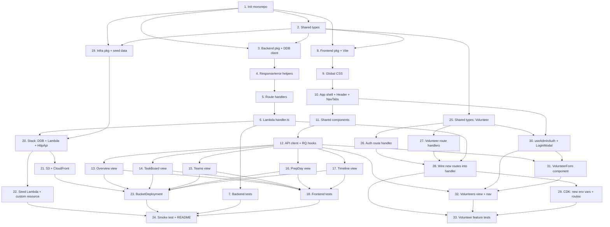

# Implementation Plan

## Overview

This implementation plan delivers the Nepali Europapokal 2026 Manager — a TypeScript + React SPA backed by AWS serverless infrastructure (Lambda, API Gateway, DynamoDB, S3, CloudFront), defined as a single AWS CDK stack. The plan is organized as a monorepo (npm workspaces) with four packages: `shared` (types), `backend` (Lambda handlers + DDB client), `frontend` (Vite/React SPA), and `infra` (CDK stack + seed data). Tasks are sequenced bottom-up: shared types first, then backend and frontend in parallel, then infrastructure that consumes both, and finally end-to-end smoke testing and documentation. The Task Dependency Graph below shows precedence relationships and a JSON wave plan that groups parallelizable tasks.

## Tasks

- [ ] 1. Initialize monorepo workspace structure
  - Create root `package.json` with npm workspaces declaring `frontend`, `backend`, `shared`, and `infra`
  - Create `tsconfig.base.json` with strict TypeScript settings (target ES2022, moduleResolution node, strict true)
  - Create empty workspace folders: `frontend/`, `backend/`, `shared/`, `infra/`
  - Add root `.gitignore` for `node_modules`, `dist`, `cdk.out`, `.env`
  - Add root scripts: `build`, `test`, `deploy` orchestrating workspace commands
  - _Requirements: 9.3_
  - _Design: Project Structure, Build & Deployment_

- [ ] 2. Create shared types package
  - Create `shared/package.json` with name `@nepal-football/shared` and tsc build script
  - Create `shared/tsconfig.json` extending base with `outDir: dist`, `declaration: true`
  - Create `shared/types.ts` exporting `Priority`, `Task`, `PrepItem`, `Milestone`, `Team`, `Bootstrap`, `ApiError` types matching the design
  - Verify build produces `dist/types.d.ts` and `dist/types.js`
  - _Requirements: 8.1, 8.2, 8.3, 8.4_
  - _Design: TypeScript Types Shared Between Frontend and Backend_

- [ ] 3. Set up backend package with dependencies and DynamoDB client wrapper
  - Create `backend/package.json` depending on `@aws-sdk/client-dynamodb`, `@aws-sdk/lib-dynamodb`, `@aws-sdk/util-dynamodb`, `@nepal-football/shared`, and dev deps `vitest`, `aws-sdk-client-mock`, `@types/aws-lambda`
  - Create `backend/tsconfig.json` extending base, target ES2022, module NodeNext
  - Create `backend/src/db/ddb.ts` exporting a singleton `DynamoDBDocumentClient` configured from `process.env.AWS_REGION` plus helpers `queryByPK(pk)`, `getItem(pk, sk)`, `updateDone(pk, sk, done)` using `ConditionExpression: attribute_exists(PK)`
  - Sort `queryByPK` results by `sortKey` ascending before returning
  - _Requirements: 8.5, 8.6, 8.7_
  - _Design: DynamoDB Single-Table Design, Access Patterns_

- [ ] 4. Implement backend response and error helpers
  - Create `backend/src/lib/response.ts` exporting `jsonResponse(status, body)` returning `{ statusCode, headers: { 'content-type': 'application/json', CORS headers }, body: JSON.stringify(body) }`
  - Create `backend/src/lib/errors.ts` exporting `errorResponse(status, code, message)` and `errorResponse.fromException(err)` that maps `ConditionalCheckFailedException` → 404 NOT_FOUND, validation errors → 400 BAD_REQUEST, `ProvisionedThroughputExceededException`/`ServiceUnavailable`/network → 503 SERVICE_UNAVAILABLE, else 500
  - Add a `validateDoneBody(raw)` helper that parses JSON and asserts `body.done` is a boolean, throwing a tagged validation error otherwise
  - _Requirements: 7.5, 7.6, 7.7_
  - _Design: API Endpoints, Error Handling_

- [ ] 5. Implement backend route handlers for tasks, teams, prep, milestones, and bootstrap
  - Create `backend/src/routes/tasks.ts` with `listTasks()` (Query PK=TASK) and `toggleTask(event)` (parses `{id}` and body, calls `updateDone('TASK', id, done)`, returns updated `Task`)
  - Create `backend/src/routes/teams.ts` with `listTeams()` (Query PK=TEAM)
  - Create `backend/src/routes/prep.ts` with `listPrep()` and `togglePrep(event)`
  - Create `backend/src/routes/milestones.ts` with `listMilestones()` and `toggleMilestone(event)`
  - Create `backend/src/routes/bootstrap.ts` with `getBootstrap()` running 4 queries in `Promise.all` and returning `{ tasks, teams, prepItems, milestones }`
  - _Requirements: 7.1, 7.3, 7.4, 8.6_
  - _Design: API Endpoints, Lambda Organization_

- [ ] 6. Implement Lambda entry handler with route switch
  - Create `backend/src/handler.ts` exporting an async `handler(event: APIGatewayProxyEventV2)` with a switch on `event.routeKey` covering all 8 routes from the design
  - Wrap the switch in try/catch using `errorResponse.fromException` for unexpected errors
  - Return 404 NOT_FOUND for unknown routes
  - Log `routeKey` and `requestId` to CloudWatch on entry and on error
  - _Requirements: 7.1, 7.2, 7.5, 7.6, 7.7_
  - _Design: Lambda Organization_

- [ ] 7. Write backend unit tests with Vitest and aws-sdk-client-mock
  - Create `backend/vitest.config.ts` and `backend/src/__tests__/` folder
  - Add tests for each route covering happy path (200), validation error (400 from non-boolean `done`), missing item (404 from mocked `ConditionalCheckFailedException`), and DDB outage (503 from mocked `ServiceUnavailable`)
  - Add a snapshot test for the `getBootstrap()` response shape using fixture data
  - Add a test verifying `queryByPK` returns items sorted by `sortKey` ascending
  - _Requirements: 7.3, 7.4, 7.5, 7.6, 7.7_
  - _Design: Testing Strategy_

- [ ] 8. Set up frontend package with Vite, React, and dependencies
  - Create `frontend/package.json` depending on `react`, `react-dom`, `react-router-dom`, `@tanstack/react-query`, `react-hot-toast`, `@nepal-football/shared`, dev deps `vite`, `@vitejs/plugin-react`, `typescript`, `vitest`, `@testing-library/react`, `@testing-library/jest-dom`, `msw`, `jsdom`
  - Create `frontend/vite.config.ts` with React plugin, build outDir `dist`, and `define` for `VITE_API_BASE_URL` defaulting to `/api`
  - Create `frontend/tsconfig.json` extending base with `jsx: react-jsx`, `lib: [DOM, ES2022]`
  - Create `frontend/index.html` with `<meta name="viewport" content="width=device-width, initial-scale=1.0">`, Google Fonts links for Bebas Neue, Barlow Condensed, Barlow, and `<div id="root">`
  - Create `frontend/src/main.tsx` rendering `<App />` into `#root`
  - _Requirements: 9.3, 9.5, 10.4_
  - _Design: Tech Stack_

- [ ] 9. Port template global stylesheet verbatim
  - Create `frontend/src/styles/global.css` copying CSS custom properties from the template (`--navy`, `--red`, `--gold`, `--dark`, `--card`, `--border`, `--text`, `--muted`, `--success`, `--warn`)
  - Port all template classes: layout, `.card`, `.stat-card`, `.task-item`, `.team-card`, `.prep-banner`, `.tl-card`, `.progress-bar`, navigation tabs styling
  - Port responsive breakpoints at 700px (4-col → 2-col stat grid, single-column content/teams, padding 28→16) and 420px (proportional header/nav padding)
  - Set min-height/min-width 44px on `.task-item`, `.checklist-item`, `.tl-card`, and `.nav-tab` for touch targets
  - Apply horizontal scroll (`overflow-x: auto; flex-wrap: nowrap`) on the nav tab bar
  - _Requirements: 9.4, 9.5, 10.1, 10.2, 10.3, 10.5_
  - _Design: Styling Approach_

- [ ] 10. Implement App shell with QueryClientProvider, HashRouter, Header, and NavTabs
  - Create `frontend/src/App.tsx` wrapping the tree in `QueryClientProvider` (with `staleTime: 30_000`, `retry: 1`) and `HashRouter`, importing `styles/global.css`, mounting `<Toaster />` from react-hot-toast
  - Define `<Routes>` for `/`, `/tasks`, `/teams`, `/prep`, `/timeline` rendering placeholder views for now
  - Create `frontend/src/components/Header.tsx` with static markup: Nepal flag, eyebrow text, title, venue/date meta from the template
  - Create `frontend/src/components/NavTabs.tsx` rendering five `<NavLink>`s for the five routes; uses `useLocation()` and applies `active` class with gold (#FFD700) bottom border and gold text on the matching route, semi-transparent white otherwise
  - _Requirements: 1.1, 1.2, 1.3, 1.4, 1.5, 9.6_
  - _Design: Component Tree, Component Specifications (App, Header, NavTabs)_

- [ ] 11. Implement shared presentational components
  - Create `frontend/src/components/ProgressBar.tsx` with props `{ label, done, total, gradient? }` rendering header (label + percentage), bar, and sub-line; percentage = `Math.round((done/total)*100)` and `0` when `total === 0`
  - Create `frontend/src/components/StatCard.tsx` with props `{ icon, value, label, accent? }`
  - Create `frontend/src/components/TaskItem.tsx` with props `{ task, onToggle?, compact? }`; renders checkbox, name, team, time, color-coded priority badge (red/amber/green); applies strikethrough + opacity 0.5 + green checkmark when `task.done`; read-only when `onToggle` omitted
  - Create `frontend/src/components/ChecklistItem.tsx` with props `{ item, onToggle }`; checkbox shows green checkmark when done, empty bordered box otherwise; strikethrough + reduced opacity when done
  - Create `frontend/src/components/MilestoneItem.tsx` with props `{ milestone, onToggle?, withDot? }`; filled green dot + strikethrough + 0.5 opacity when done, unfilled dot + normal otherwise
  - _Requirements: 2.2, 2.3, 3.3, 3.4, 3.7, 5.2, 5.4, 6.4_
  - _Design: Component Specifications (Shared components)_

- [ ] 12. Implement API client and React Query hooks with optimistic updates
  - Create `frontend/src/api/client.ts` exporting `apiFetch(path, init)` using `import.meta.env.VITE_API_BASE_URL`, parsing JSON, and throwing an `ApiError` shaped error on non-2xx
  - Create `frontend/src/api/hooks.ts` exporting query hooks `useBootstrap`, `useTasks`, `useTeams`, `usePrepItems`, `useMilestones` with the keys from the design and `staleTime: 30_000`
  - Export mutation hooks `useToggleTask`, `useTogglePrepItem`, `useToggleMilestone` implementing the optimistic-update pattern: `onMutate` cancels queries, snapshots previous data, writes optimistic value into the cache; `onError` restores the snapshot and shows a `react-hot-toast` error like "Couldn't save change, please retry"; `onSettled` invalidates the query
  - Each mutation calls `PATCH /<resource>/<id>` with body `{ done: boolean }`
  - _Requirements: 2.7, 3.5, 3.6, 5.5, 5.6, 6.5, 6.6, 7.4_
  - _Design: State Management, Error Handling (Frontend)_

- [ ] 13. Implement Overview view
  - Create `frontend/src/views/Overview.tsx` using `useBootstrap()` to fetch tasks, teams, prepItems, milestones in one call
  - Render four `StatCard`s: Tournament Days (2), Volunteer Roles (`tasks.length`), Specialist Teams (`teams.length`), Tasks Completed (`done/total`)
  - Render `ProgressBar` for tasks (done/total/percentage/remaining) and another for milestones; values memoized with `useMemo`
  - Render list of high-priority tasks (filter `priority === 'high'`) using read-only `TaskItem`
  - Render the first 5 milestones in chronological/`sortKey` order using `MilestoneItem` (read-only)
  - Render an event-info banner showing venue (Sportanlage Grüngürtel, Berlin), tournament dates (04–05 July 2026), preparation day (03 July 2026)
  - _Requirements: 2.1, 2.2, 2.3, 2.4, 2.5, 2.6, 2.7, 2.8_
  - _Design: Component Specifications (Overview)_

- [ ] 14. Implement TaskBoard view
  - Create `frontend/src/views/TaskBoard.tsx` using `useTasks()` and `useToggleTask()`
  - Sort tasks by priority (high → medium → low), then by `sortKey`/time
  - Render each task in a `TaskItem` with `onToggle` invoking the mutation
  - Wrap the list in a `.card` container matching the template
  - On mutation error rely on the hook's optimistic rollback + toast for revert behavior
  - _Requirements: 3.1, 3.2, 3.3, 3.4, 3.5, 3.6, 3.7_
  - _Design: Component Specifications (TaskBoard)_

- [ ] 15. Implement Teams view
  - Create `frontend/src/views/Teams.tsx` using `useTeams()`
  - Render a 2-column grid of team cards; each card shows icon, name, volunteer count, vertical list of up to 5 assigned task labels
  - Apply 5px solid left-border using inline style with `team.color`
  - On query error display "Team information is unavailable" inline message
  - _Requirements: 4.1, 4.2, 4.3, 4.4_
  - _Design: Component Specifications (Teams)_

- [ ] 16. Implement PrepDay view
  - Create `frontend/src/views/PrepDay.tsx` using `usePrepItems()` and `useTogglePrepItem()`
  - Render `prep-banner` with date (03 July 2026), venue (Sportanlage Grüngürtel), start time (14:00)
  - Render `ProgressBar` showing `done/total` percentage rounded to nearest integer
  - Render each item via `ChecklistItem` with `onToggle` wired to the mutation
  - _Requirements: 5.1, 5.2, 5.3, 5.4, 5.5, 5.6_
  - _Design: Component Specifications (PrepDay)_

- [ ] 17. Implement Timeline view
  - Create `frontend/src/views/Timeline.tsx` using `useMilestones()` and `useToggleMilestone()`
  - Render `ProgressBar` for milestone completion percentage
  - Render milestones in chronological/`sortKey` order in a vertical timeline layout with connecting line and dot indicators (`withDot` on `MilestoneItem`)
  - Each item toggles via the mutation; rollback handled by the hook
  - _Requirements: 6.1, 6.2, 6.3, 6.4, 6.5, 6.6, 6.7_
  - _Design: Component Specifications (Timeline)_

- [ ] 18. Write frontend unit tests with Vitest, RTL, and MSW
  - Create `frontend/vitest.config.ts` with `jsdom` environment and `setupFiles` registering `@testing-library/jest-dom` and an MSW server with default handlers for all API routes
  - Test that `Overview` computes correct counts and percentages from fixture bootstrap data and that derived stats update after a toggle
  - Test `TaskBoard` toggles a task on click and rolls back when the MSW handler returns 503
  - Test `NavTabs` highlights the active tab and updates `window.location.hash` when clicked
  - Test `ProgressBar` returns 0% on empty list and clamps in [0,100]
  - _Requirements: 1.2, 1.3, 1.5, 2.2, 2.3, 2.7, 3.5, 3.6_
  - _Design: Testing Strategy (Frontend), Correctness Properties 1, 2, 3, 4, 10_

- [ ] 19. Set up infra package with CDK and seed data
  - Create `infra/package.json` depending on `aws-cdk-lib`, `constructs`, `@nepal-football/shared`, `uuid`, dev dep `aws-cdk`
  - Create `infra/cdk.json` with `app: "npx ts-node --prefer-ts-exts bin/app.ts"`
  - Create `infra/tsconfig.json` extending base
  - Create `infra/bin/app.ts` instantiating `NepalFootballStack` in region `eu-central-1`
  - Create `infra/lib/seed-data.ts` exporting hard-coded arrays `tasks` (15), `teams` (6), `prepItems` (9), `milestones` (9) ported from the original template, each with a `sortKey` matching its array index
  - _Requirements: 9.1, 9.2_
  - _Design: Infrastructure (AWS CDK), Data Seeding_

- [ ] 20. Implement NepalFootballStack with DynamoDB, Lambda, and HttpApi
  - Create `infra/lib/nepal-football-stack.ts` defining a `Stack` subclass
  - Create the DynamoDB `Table` with PK (string) + SK (string), `BillingMode.PAY_PER_REQUEST`, `pointInTimeRecovery: true`, encryption AWS-managed, `RemovalPolicy.RETAIN`
  - Create the `apiLambda` as a `NodejsFunction` pointing to `backend/src/handler.ts`, runtime `NODEJS_20_X`, architecture `ARM_64`, memory 256, timeout 10s, env `TABLE_NAME`
  - Grant `table.grantReadWriteData(apiLambda)`
  - Create the `HttpApi` with CORS allowing the CloudFront domain plus `http://localhost:5173`, mapping all 8 routes (`GET /bootstrap`, `GET /tasks`, `PATCH /tasks/{id}`, `GET /teams`, `GET /prep-items`, `PATCH /prep-items/{id}`, `GET /milestones`, `PATCH /milestones/{id}`) to `HttpLambdaIntegration(apiLambda)`
  - Output `ApiUrl` and `TableName`
  - _Requirements: 7.1, 7.2, 8.5, 8.7_
  - _Design: Infrastructure (AWS CDK)_

- [ ] 21. Add S3 bucket and CloudFront distribution with OAC to the stack
  - Add a private `siteBucket` (`s3.Bucket`) with block-public-access, SSE-S3 encryption, `RemovalPolicy.RETAIN`
  - Create a `cloudfront.Distribution` with default behavior using S3 origin via OAC and `CACHING_OPTIMIZED`
  - Add `/api/*` behavior with API Gateway origin, `AllViewer` request policy, `CACHING_DISABLED`
  - Configure `errorResponses` mapping 403 and 404 to `/index.html` with status 200 for SPA routing
  - Apply minimum protocol `TLSv1.2_2021` and add an HSTS response headers policy
  - Output `DistributionDomainName`
  - _Requirements: 9.1, 9.2, 9.6_
  - _Design: Infrastructure (AWS CDK), Security Considerations_

- [ ] 22. Implement seed Lambda and custom resource
  - Create `infra/lib/seed-lambda/index.ts` (a separate small `NodejsFunction`) that scans the table; if empty, generates UUIDs for each seed item, attaches `sortKey`, and `BatchWriteItem`s all 15 tasks, 6 teams, 9 prep items, and 9 milestones from `seed-data.ts`
  - Make the seed handler idempotent — skip writes when scan returns any items
  - In the stack, instantiate the seed Lambda, grant it `table.grantReadWriteData`, and trigger it via an `AwsCustomResource` with a Provider on stack create/update
  - _Requirements: 8.6, 8.7_
  - _Design: Data Seeding, Correctness Property 9_

- [ ] 23. Add BucketDeployment to upload SPA assets and invalidate CloudFront
  - Add `s3deploy.BucketDeployment` to the stack that takes `Source.asset('../frontend/dist')` and deploys to `siteBucket`
  - Pass `distribution` and `distributionPaths: ['/*']` to invalidate CloudFront on each deploy
  - Ensure `BucketDeployment` runs after the `BucketDeployment` step depends on the frontend build (root deploy script builds frontend first)
  - _Requirements: 9.1, 9.2, 9.6_
  - _Design: Build & Deployment_

- [ ] 24. Add end-to-end smoke test script and README
  - Create `scripts/smoke.ts` that reads the deployed API URL (CDK output or env var), `GET /bootstrap`, asserts the response shape contains non-empty `tasks/teams/prepItems/milestones`, then `PATCH`es a sample task and re-fetches to verify the `done` value persisted
  - Create root `README.md` documenting prerequisites (Node 20, AWS credentials, CDK bootstrap), install (`npm install`), build (`npm run build`), test (`npm run test`), deploy (`npm run deploy`), and how to run the smoke script after deploy
  - Document local dev: `npm run dev -w frontend` and pointing `VITE_API_BASE_URL` at the deployed API
  - _Requirements: 7.3, 7.4_
  - _Design: Testing Strategy (Integration), Build & Deployment_

- [ ] 25. Extend shared types with Volunteer, VolunteerDay, LoginRequest, and AuthResponse
  - Open `shared/types.ts` and add:
    - `export type VolunteerDay = 'Friday' | 'Saturday' | 'Sunday';`
    - `export interface Volunteer { id: string; name: string; days: VolunteerDay[]; taskIds: string[]; }`
    - `export interface LoginRequest { username: string; password: string; }`
    - `export interface AuthResponse { token: string; }`
  - Rebuild the shared package and verify `dist/types.d.ts` exports the new types
  - _Requirements: 14.1_
  - _Design: TypeScript Types Shared Between Frontend and Backend_

- [ ] 26. Implement auth route handler (login endpoint)
  - Install `jsonwebtoken` and `bcryptjs` (and their `@types`) in the backend package
  - Create `backend/src/routes/auth.ts` exporting `login(event)`:
    - Parse and validate request body as `LoginRequest` (both fields required strings) → 400 on failure
    - Compare `username` against `process.env.ADMIN_USERNAME` and `password` against `process.env.ADMIN_PASSWORD_HASH` using `bcrypt.compare` → 401 on mismatch
    - On success sign a JWT with `process.env.JWT_SECRET`, algorithm HS256, expiry 8 hours, payload `{ sub: username, role: 'admin' }`
    - Return `{ token }` as `AuthResponse`
  - Create `backend/src/lib/auth.ts` exporting `verifyAdminToken(event)` that reads the `Authorization: Bearer <token>` header, verifies the JWT signature and expiry, and throws a tagged 401 error if invalid or missing
  - _Requirements: 11.6, 11.7_
  - _Design: Auth State, API Endpoints, Security Considerations_

- [ ] 27. Implement volunteer route handlers (CRUD)
  - Create `backend/src/routes/volunteers.ts` exporting:
    - `listVolunteers()` — `Query` PK=`VOLUNTEER`, sort by `sortKey`, return `Volunteer[]`
    - `createVolunteer(event)` — call `verifyAdminToken`, parse body `{ name, days, taskIds }`, validate (name required max 100, days non-empty array of valid VolunteerDay values, taskIds array 0–20), generate UUID for SK, `PutItem` with `ConditionExpression: attribute_not_exists(SK)`, return created `Volunteer` with 201
    - `updateVolunteer(event)` — call `verifyAdminToken`, parse `{id}` from path, parse and validate body same as create, `UpdateItem` with `ConditionExpression: attribute_exists(PK)` → 404 on `ConditionalCheckFailedException`, return updated `Volunteer`
    - `deleteVolunteer(event)` — call `verifyAdminToken`, parse `{id}`, `DeleteItem` with `ConditionExpression: attribute_exists(PK)` → 404 on fail, return empty 204
  - Add `VOLUNTEER` PK support to `backend/src/db/ddb.ts` (add `putItem`, `deleteItem` helpers alongside existing `updateDone`)
  - _Requirements: 14.1, 14.2, 14.3, 14.4, 14.5_
  - _Design: API Endpoints, Lambda Organization, DynamoDB Single-Table Design_

- [ ] 28. Wire new routes into Lambda handler
  - Open `backend/src/handler.ts` and add cases to the route switch:
    ```ts
    case 'POST /auth/login':          return jsonResponse(200, await login(event));
    case 'GET /volunteers':           return jsonResponse(200, await listVolunteers());
    case 'POST /volunteers':          return jsonResponse(201, await createVolunteer(event));
    case 'PUT /volunteers/{id}':      return jsonResponse(200, await updateVolunteer(event));
    case 'DELETE /volunteers/{id}':   return jsonResponse(204, await deleteVolunteer(event));
    ```
  - Import `login` from `./routes/auth` and all volunteer handlers from `./routes/volunteers`
  - Ensure `errorResponse.fromException` already handles 401 (add mapping: tagged auth error → 401 UNAUTHORIZED if not present)
  - _Requirements: 11.6, 14.4_
  - _Design: Lambda Organization_

- [ ] 29. Update CDK stack with new Lambda env vars and API routes
  - Open `infra/lib/nepal-football-stack.ts`
  - Add env vars to `apiLambda`: `ADMIN_USERNAME`, `ADMIN_PASSWORD_HASH`, `JWT_SECRET` — read from CDK context (`this.node.tryGetContext`) with a fallback that throws a descriptive error if not provided
  - Add the 5 new routes to the `HttpApi`: `POST /auth/login`, `GET /volunteers`, `POST /volunteers`, `PUT /volunteers/{id}`, `DELETE /volunteers/{id}` — all using the same `HttpLambdaIntegration(apiLambda)`
  - Document in a comment that `ADMIN_PASSWORD_HASH` must be a bcrypt hash (cost 12) generated offline and passed as CDK context, e.g. `cdk deploy --context adminUsername=admin --context adminPasswordHash='$2b$12$...' --context jwtSecret=<random-32-char-string>`
  - _Requirements: 11.6_
  - _Design: Infrastructure (AWS CDK), Security Considerations_

- [ ] 30. Implement useAdminAuth hook and LoginModal component
  - Create `frontend/src/api/hooks.ts` addition (or a new `frontend/src/hooks/useAdminAuth.ts`): export `useAdminAuth()` returning `{ isAdmin: boolean, login(token: string): void, logout(): void }` backed by `useState` initialized from `sessionStorage.getItem('admin_token')` (non-null = admin); `login` stores the token and sets state; `logout` removes it and clears state
  - Create `frontend/src/components/LoginModal.tsx`:
    - Props: `{ isOpen: boolean, onClose: () => void, onSuccess: () => void }`
    - Controlled form with username and password inputs, submit button, and an error message area
    - On submit: `POST /auth/login` via `apiFetch`; on 200 call `login(token)` from `useAdminAuth` then `onSuccess` then `onClose`; on 401 show "Invalid username or password"; on other error show generic message
    - Accessible: `<label>` for each input, focus trap inside modal, Escape key closes, `role="dialog"` with `aria-modal="true"`
  - Update `frontend/src/components/Header.tsx` to use `useAdminAuth()`: render "Login" button when not admin (opens modal), "Logout" button when admin (calls `logout()`)
  - Update `frontend/src/App.tsx` to manage `loginModalOpen` state and pass it to `Header` and `LoginModal`
  - _Requirements: 11.1, 11.2, 11.3, 11.4, 11.5, 11.7, 11.8_
  - _Design: Auth State, Component Specifications (LoginModal)_

- [ ] 31. Implement VolunteerForm component
  - Create `frontend/src/components/VolunteerForm.tsx`:
    - Props: `{ volunteer?: Volunteer, onSave: (v: Volunteer) => void, onCancel: () => void }`
    - Fields: name text input (required, maxLength 100), three checkboxes (Friday, Saturday, Sunday), multi-select task list from `useTasks()` cache (display task names, value = task id)
    - Client-side validation on submit: name empty → inline "Name is required"; no day checked → inline "Select at least one day"
    - Edit mode: pre-populate name, days, and taskIds; filter out task IDs not present in current tasks list (stale refs)
    - On valid submit: call `useCreateVolunteer` (create) or `useUpdateVolunteer` (edit) mutation; on success call `onSave(result)`; on API error display error message and keep form open
    - Cancel button calls `onCancel`
  - _Requirements: 12.1, 12.2, 12.3, 12.4, 12.5, 12.6, 12.7, 12.8_
  - _Design: Component Specifications (VolunteerForm)_

- [ ] 32. Implement Volunteers view and wire into navigation
  - Create `frontend/src/views/Volunteers.tsx`:
    - Data: `useVolunteers()` query hook (`GET /volunteers`); add this hook to `frontend/src/api/hooks.ts`
    - Mutation hooks: `useCreateVolunteer` (`POST /volunteers`), `useUpdateVolunteer` (`PUT /volunteers/{id}`), `useDeleteVolunteer` (`DELETE /volunteers/{id}`) — add to `hooks.ts`; all three send `Authorization: Bearer <token>` header from `sessionStorage`
    - Auth: `const { isAdmin } = useAdminAuth()`
    - Render: page header, "Add Volunteer" button (only when `isAdmin`), `<table>` with columns Volunteer Name / Friday / Saturday / Sunday / Tasks / Actions (admin only)
    - Each row: `VolunteerRow` component with `isAdmin` prop
    - Empty state: "No volunteers registered yet" when `volunteers.length === 0`
    - Load error: "Volunteer information is unavailable"
    - Add/Edit: open `VolunteerForm` in a modal overlay; on save close modal and invalidate `['volunteers']` query
    - Delete: `useDeleteVolunteer` mutation; on error show toast "Couldn't delete volunteer, please retry"
  - Update `frontend/src/components/NavTabs.tsx` to add a sixth tab "Volunteer" linking to `#/volunteers`
  - Update `frontend/src/App.tsx` `<Routes>` to add `<Route path="/volunteers" element={<Volunteers />} />`
  - _Requirements: 13.1, 13.2, 13.3, 13.4, 13.5, 13.6, 13.7, 13.8, 13.9, 13.10, 13.11, 13.12_
  - _Design: Component Specifications (Volunteers, VolunteerRow), State Management_

- [ ] 33. Write tests for volunteer feature (frontend and backend)
  - **Backend tests** (add to `backend/src/__tests__/`):
    - `auth.test.ts`: `POST /auth/login` returns 200 + token with valid creds; returns 401 with wrong password; returns 400 with missing fields
    - `volunteers.test.ts`: `GET /volunteers` returns 200 with list; `POST /volunteers` returns 201 with valid body + valid token; returns 400 with missing name; returns 401 with no/invalid token; `PUT /volunteers/{id}` returns 200 on update, 404 on missing; `DELETE /volunteers/{id}` returns 204 on success, 404 on missing, 401 on no token
  - **Frontend tests** (add to `frontend/src/`):
    - `LoginModal.test.tsx`: renders username/password fields; shows "Invalid username or password" on MSW 401; stores token and calls onSuccess on MSW 200
    - `Volunteers.test.tsx`: renders read-only table (no Add/Edit/Delete) when not admin; renders Add button and action icons when admin token in sessionStorage; shows "No volunteers registered yet" on empty list; shows "Volunteer information is unavailable" on MSW 503
    - `VolunteerForm.test.tsx`: shows "Name is required" when name empty on submit; shows "Select at least one day" when no day checked; calls onSave with correct payload on valid submit
  - Add MSW handlers for all 5 new endpoints to `frontend/src/test/msw-server.ts`
  - Add volunteer fixtures to `frontend/src/test/fixtures.ts`
  - _Requirements: 11.1–11.8, 12.1–12.8, 13.1–13.12, 14.1–14.5_
  - _Design: Testing Strategy_

## Task Dependency Graph



```json
{
  "waves": [
    { "wave": 1, "tasks": [1] },
    { "wave": 2, "tasks": [2] },
    { "wave": 3, "tasks": [3, 8, 19, 25] },
    { "wave": 4, "tasks": [4, 9] },
    { "wave": 5, "tasks": [5, 10] },
    { "wave": 6, "tasks": [6, 11] },
    { "wave": 7, "tasks": [7, 12, 20] },
    { "wave": 8, "tasks": [13, 14, 15, 16, 17, 21, 22] },
    { "wave": 9, "tasks": [18, 23] },
    { "wave": 10, "tasks": [24] },
    { "wave": 11, "tasks": [26, 27, 30] },
    { "wave": 12, "tasks": [28, 31] },
    { "wave": 13, "tasks": [29, 32] },
    { "wave": 14, "tasks": [33] }
  ]
}
```

## Notes

- **Conventions**
  - Language: TypeScript everywhere with `strict: true`. Target ES2022, Node 20 runtime on Lambda (ARM64).
  - Package manager: npm with workspaces; do not introduce yarn or pnpm.
  - Module style: ESM in frontend (Vite default); NodeNext in backend so AWS SDK v3 imports work cleanly.
  - Shared types in `@nepal-football/shared` are the single source of truth — both backend and frontend import from there, no duplication.

- **Testing**
  - Backend: Vitest + `aws-sdk-client-mock`. Cover happy path, 400, 404 (`ConditionalCheckFailedException`), and 503 (`ServiceUnavailable`) per route.
  - Frontend: Vitest + React Testing Library + MSW. Use MSW handlers as the contract; the same handlers exercise both happy paths and failure rollback (503).
  - Integration: `scripts/smoke.ts` runs after deploy against the real API URL.

- **State and error handling**
  - All server state flows through React Query with `staleTime: 30_000` and `retry: 1`.
  - Mutations use the optimistic update + rollback pattern (`onMutate` snapshots, `onError` restores, `onSettled` invalidates) to satisfy revert-on-failure requirements.
  - Errors surface to users via `react-hot-toast` with a generic, retryable message.

- **Infrastructure safety**
  - DynamoDB and S3 buckets use `RemovalPolicy.RETAIN` to prevent accidental data loss on stack destroy.
  - Point-in-time recovery is enabled on the table.
  - CloudFront uses TLSv1.2_2021 + HSTS; S3 is private behind OAC.
  - Seed lambda is idempotent (no-op when table is non-empty) so re-deploys are safe.

- **Wave execution**
  - The JSON `waves` block above defines parallelizable groups: tasks within a wave have no dependencies on each other and can be executed concurrently. A task only enters a wave once all its prerequisites (per the Mermaid graph) are completed in earlier waves.
  - Backend (3→4→5→6→7) and frontend (8→9→10→11→12→views→18) tracks run in parallel after wave 2; infra (19→20→21/22→23) joins in once shared types and the Lambda handler exist.
  - Volunteer feature (25→26/27/30→28/31→29/32→33) runs as a self-contained track after wave 2 (shared types) and gates on the existing handler (T6) and hooks (T10, T12) being complete.

- **Auth**
  - Admin JWT is verified in the Lambda on every protected route. The `verifyAdminToken` helper is called at the top of each admin-only route handler. Credentials (`ADMIN_USERNAME`, `ADMIN_PASSWORD_HASH`, `JWT_SECRET`) are passed as CDK context variables and injected as Lambda env vars — never committed to source.

- **Volunteer mutations**
  - `useCreateVolunteer`, `useUpdateVolunteer`, and `useDeleteVolunteer` attach the `Authorization: Bearer <token>` header from `sessionStorage`. If the token is missing or expired the API returns 401 and the frontend shows a toast prompting the user to log in again.
